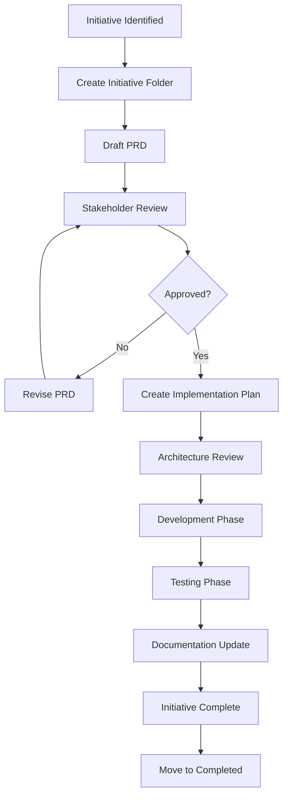
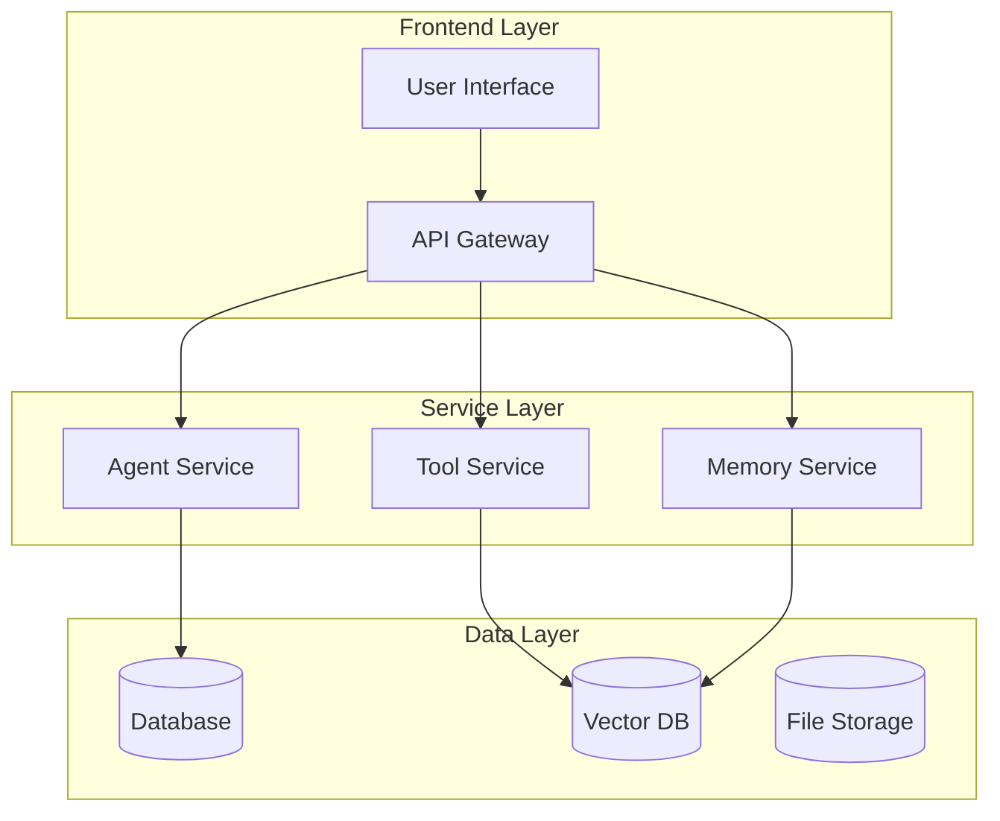
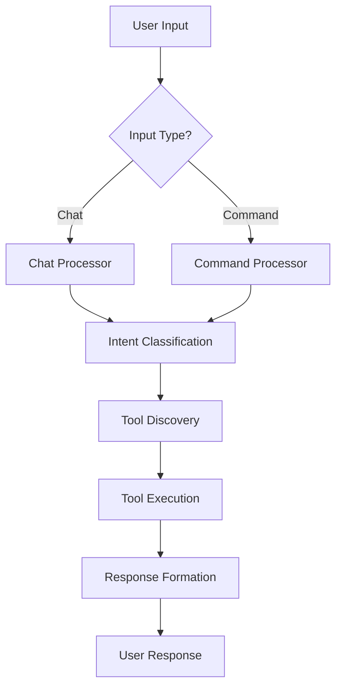
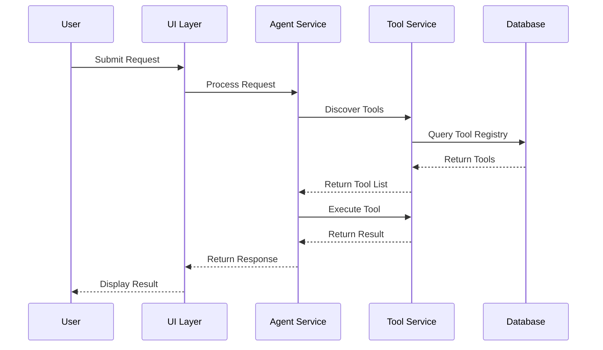
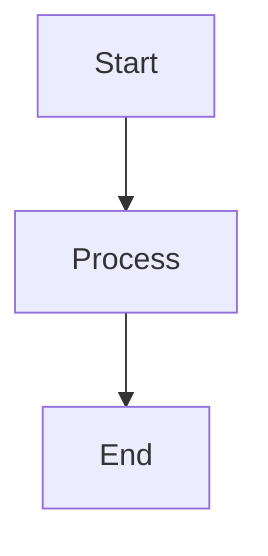

# AI-Driven Development Documentation Architecture & Guidelines

**🎯 Comprehensive Guide for Structured Documentation, PRDs, and Development Workflows**

*This document outlines the complete architecture for documentation management, product requirements, implementation guides, and user experience flows in the cw-agent-swarm platform.*

## 📋 Table of Contents

1. [Documentation Architecture Overview](#documentation-architecture-overview)
2. [Documentation Creation Guidelines](#documentation-creation-guidelines)
3. [PRD & Implementation Documentation Process](#prd--implementation-documentation-process)
4. [Initiative Categorization System](#initiative-categorization-system)
5. [UX Flow Documentation](#ux-flow-documentation)
6. [Mermaid Diagram Standards](#mermaid-diagram-standards)
7. [Folder Prompt Instructions](#folder-prompt-instructions)
8. [Implementation Guidelines Restructuring](#implementation-guidelines-restructuring)
9. [Implementation Plan for docs_v2](#implementation-plan-for-docs_v2)

---

## 📁 Documentation Architecture Overview

### Current State Analysis
Our existing documentation is scattered across multiple locations without clear organization:
- Implementation guides mixed with architectural documentation
- No clear PRD process or standardized templates
- Missing UX flow documentation for complex user journeys
- Inconsistent naming and categorization

### Proposed docs_v2 Structure
```
docs_v2/
├── 📋 README.md                              # Master navigation hub
├── 📐 guidelines/                            # Documentation creation guidelines
│   ├── README.md                            # Guidelines overview
│   ├── documentation-standards.md           # Writing and formatting standards
│   ├── prd-template.md                      # Product Requirements Document template
│   ├── implementation-template.md           # Implementation documentation template
│   ├── architecture-template.md             # Architecture documentation template
│   ├── mermaid-standards.md                 # Diagram creation guidelines
│   └── _PROMPT_INSTRUCTIONS.md              # AI prompt instructions for this folder
├── 🏗️ architecture/                          # System architecture
│   ├── README.md                            # Architecture overview
│   ├── core-principles.md                   # @CODE_ARCHITECTURE_GUIDELINES.md
│   ├── patterns/                            # Design patterns
│   │   ├── dependency-injection.md
│   │   ├── service-layer.md
│   │   ├── error-handling.md
│   │   ├── provider-patterns.md
│   │   └── factory-patterns.md
│   ├── services/                            # Service architecture
│   │   ├── service-layer-guide.md
│   │   ├── integration-patterns.md
│   │   └── cross-system-communication.md
│   ├── database/                            # Data architecture
│   │   ├── prisma-patterns.md
│   │   ├── qdrant-integration.md
│   │   ├── dual-id-strategy.md
│   │   └── migration-strategies.md
│   ├── diagrams/                            # Architecture diagrams
│   │   ├── system-overview.md
│   │   ├── service-dependencies.md
│   │   └── data-flow.md
│   └── _PROMPT_INSTRUCTIONS.md              # AI prompt instructions for this folder
├── 📏 standards/                             # Code quality standards
│   ├── README.md                            # Standards overview
│   ├── typescript/                         # TypeScript standards
│   │   ├── typing-patterns.md
│   │   ├── interface-design.md
│   │   ├── error-types.md
│   │   └── testing-patterns.md
│   ├── naming/                             # Naming conventions
│   │   ├── file-naming.md
│   │   ├── class-naming.md
│   │   ├── variable-naming.md
│   │   └── constant-naming.md
│   ├── testing/                            # Testing standards
│   │   ├── unit-testing.md
│   │   ├── integration-testing.md
│   │   ├── e2e-testing.md
│   │   └── test-data-management.md
│   ├── tooling/                            # Development tools
│   │   ├── eslint-config.md
│   │   ├── typescript-config.md
│   │   ├── prettier-config.md
│   │   └── vitest-config.md
│   └── _PROMPT_INSTRUCTIONS.md              # AI prompt instructions for this folder
├── 🚀 initiatives/                          # Product development initiatives
│   ├── README.md                           # Initiative management overview
│   ├── templates/                          # Initiative templates
│   │   ├── feature-initiative.md
│   │   ├── refactoring-initiative.md
│   │   ├── integration-initiative.md
│   │   └── infrastructure-initiative.md
│   ├── active/                             # Currently active initiatives
│   │   ├── {initiative-name}/
│   │   │   ├── prd.md                      # Product Requirements Document
│   │   │   ├── implementation-plan.md      # Detailed implementation guide
│   │   │   ├── progress-tracker.md         # Progress tracking
│   │   │   ├── architecture-decisions.md   # Architecture Decision Records
│   │   │   ├── testing-strategy.md         # Testing approach
│   │   │   └── ux-flows/                   # User experience flows
│   │   │       ├── user-journey.md
│   │   │       ├── interaction-flows.md
│   │   │       └── diagrams/
│   │   └── unified-tools-foundation/       # Example initiative
│   ├── completed/                          # Completed initiatives
│   │   └── {initiative-name}/
│   ├── archived/                           # Archived/cancelled initiatives
│   │   └── {initiative-name}/
│   └── _PROMPT_INSTRUCTIONS.md              # AI prompt instructions for this folder
├── 🎯 ux-flows/                             # User experience documentation
│   ├── README.md                           # UX flows overview
│   ├── core-flows/                        # Core platform flows
│   │   ├── user-input-processing.md        # How user input is processed
│   │   ├── tool-routing-discovery.md       # Tool routing and identification
│   │   ├── memory-retrieval.md             # Memory fetching and retrieval
│   │   ├── agent-communication.md          # Agent-to-agent communication
│   │   ├── workspace-integration.md        # Workspace provider integration
│   │   ├── social-media-posting.md         # Social media content creation
│   │   └── error-handling-flow.md          # Error handling and recovery
│   ├── user-journeys/                     # Complete user journeys
│   │   ├── new-user-onboarding.md
│   │   ├── workspace-setup.md
│   │   ├── content-creation-workflow.md
│   │   └── automation-setup.md
│   ├── interaction-patterns/              # UI/UX interaction patterns
│   │   ├── approval-workflows.md
│   │   ├── notification-patterns.md
│   │   ├── real-time-updates.md
│   │   └── error-states.md
│   ├── diagrams/                          # Flow diagrams
│   │   ├── user-input-flow.mmd
│   │   ├── tool-discovery-flow.mmd
│   │   ├── memory-retrieval-flow.mmd
│   │   └── error-handling-flow.mmd
│   └── _PROMPT_INSTRUCTIONS.md              # AI prompt instructions for this folder
├── 🏢 systems/                             # System documentation
│   ├── README.md                          # Systems overview
│   ├── agents/                           # Agent system
│   │   ├── architecture.md
│   │   ├── manager-patterns.md
│   │   ├── integration-guide.md
│   │   ├── ux-flows/
│   │   └── _PROMPT_INSTRUCTIONS.md
│   ├── tools/                            # Tool system
│   │   ├── unified-foundation.md
│   │   ├── tool-creation.md
│   │   ├── cross-system-discovery.md
│   │   ├── ux-flows/
│   │   └── _PROMPT_INSTRUCTIONS.md
│   ├── workspace/                        # Workspace integrations
│   │   ├── provider-integration.md
│   │   ├── capability-patterns.md
│   │   ├── oauth-flows.md
│   │   ├── ux-flows/
│   │   └── _PROMPT_INSTRUCTIONS.md
│   ├── social-media/                     # Social media system
│   │   ├── provider-architecture.md
│   │   ├── content-generation.md
│   │   ├── approval-workflows.md
│   │   ├── ux-flows/
│   │   └── _PROMPT_INSTRUCTIONS.md
│   ├── memory/                           # Memory system
│   │   ├── retrieval-patterns.md
│   │   ├── vector-storage.md
│   │   ├── semantic-search.md
│   │   ├── ux-flows/
│   │   └── _PROMPT_INSTRUCTIONS.md
│   ├── acg/                              # Automatic Content Generation
│   │   ├── content-generation.md
│   │   ├── provider-integration.md
│   │   ├── ux-flows/
│   │   └── _PROMPT_INSTRUCTIONS.md
│   └── _PROMPT_INSTRUCTIONS.md              # AI prompt instructions for systems overview
├── 📚 api/                               # API documentation
│   ├── README.md                         # API overview
│   ├── reference/                        # API reference documentation
│   │   ├── agents.md
│   │   ├── workspace.md
│   │   ├── social-media.md
│   │   ├── memory.md
│   │   └── tools.md
│   ├── guides/                          # Integration guides
│   │   ├── authentication.md
│   │   ├── webhook-setup.md
│   │   ├── rate-limiting.md
│   │   └── error-handling.md
│   ├── examples/                        # Code examples
│   │   ├── curl-examples.md
│   │   ├── javascript-examples.md
│   │   └── python-examples.md
│   └── _PROMPT_INSTRUCTIONS.md              # AI prompt instructions for this folder
├── 🧪 testing/                           # Testing documentation
│   ├── README.md                        # Testing overview
│   ├── strategy/                        # Testing strategy
│   │   ├── unit-testing-strategy.md
│   │   ├── integration-testing-strategy.md
│   │   ├── e2e-testing-strategy.md
│   │   └── performance-testing-strategy.md
│   ├── guides/                          # Testing guides
│   │   ├── mock-setup.md
│   │   ├── test-data-management.md
│   │   ├── ci-cd-integration.md
│   │   └── coverage-requirements.md
│   ├── examples/                        # Testing examples
│   │   ├── unit-test-examples.md
│   │   ├── integration-test-examples.md
│   │   └── e2e-test-examples.md
│   └── _PROMPT_INSTRUCTIONS.md              # AI prompt instructions for this folder
├── 🚀 deployment/                        # Deployment documentation
│   ├── README.md                        # Deployment overview
│   ├── environments/                   # Environment setup
│   │   ├── development.md
│   │   ├── staging.md
│   │   ├── production.md
│   │   └── docker-setup.md
│   ├── infrastructure/                 # Infrastructure documentation
│   │   ├── database-setup.md
│   │   ├── vector-db-setup.md
│   │   ├── monitoring.md
│   │   └── security.md
│   ├── processes/                      # Deployment processes
│   │   ├── release-process.md
│   │   ├── rollback-procedures.md
│   │   └── hotfix-process.md
│   └── _PROMPT_INSTRUCTIONS.md              # AI prompt instructions for this folder
├── 📊 reports/                          # Status reports and analysis
│   ├── README.md                       # Reports overview
│   ├── architecture-audits/           # Architecture audits
│   ├── performance-reports/           # Performance analysis
│   ├── migration-reports/             # Migration status
│   ├── initiative-reports/            # Initiative progress reports
│   └── _PROMPT_INSTRUCTIONS.md              # AI prompt instructions for this folder
└── 📖 knowledge-base/                  # Institutional knowledge
    ├── README.md                      # Knowledge base overview
    ├── decisions/                     # Architecture Decision Records (ADRs)
    │   ├── template.md
    │   ├── 001-dual-id-strategy.md
    │   ├── 002-unified-tool-foundation.md
    │   └── 003-error-handling-hierarchy.md
    ├── lessons-learned/               # Lessons learned
    │   ├── refactoring-lessons.md
    │   ├── integration-lessons.md
    │   └── performance-lessons.md
    ├── troubleshooting/              # Common issues and solutions
    │   ├── common-errors.md
    │   ├── debugging-guides.md
    │   └── performance-issues.md
    ├── onboarding/                   # Team onboarding
    │   ├── developer-onboarding.md
    │   ├── codebase-tour.md
    │   └── development-workflow.md
    └── _PROMPT_INSTRUCTIONS.md              # AI prompt instructions for this folder
```

---

## 🎯 Folder Prompt Instructions

### Purpose and Structure

Each folder in docs_v2 contains a `_PROMPT_INSTRUCTIONS.md` file that provides specific guidance for AI assistants on:
- **Purpose**: What this documentation folder is for
- **Audit Scope**: What exactly to investigate and document
- **Structure Guidelines**: How to organize content within this folder
- **Quality Standards**: What makes good documentation for this specific domain
- **Cross-References**: Which other folders to reference when needed
- **README Creation**: How to create comprehensive README files for efficient navigation

### README File Requirements

Every folder must have a comprehensive `README.md` that serves as the navigation hub. The README should:
- **Explain the folder's purpose** and scope
- **Provide a complete file index** with descriptions
- **Include quick navigation links** to key documents
- **Show relationships** between documents in the folder
- **Guide different user types** (developers, architects, new team members)
- **Link to related folders** and cross-references

### Example Prompt Instruction Files

#### Example: `docs_v2/systems/tools/_PROMPT_INSTRUCTIONS.md`

```markdown
# Tools System Documentation - AI Assistant Instructions

## 📋 Purpose
Document the unified tools foundation system, individual tool implementations, and cross-system tool discovery mechanisms.

## 🔍 What to Audit and Document

### Core Components to Investigate
1. **Unified Tool Foundation** (`src/lib/tools/foundation/`)
   - UnifiedToolFoundation service architecture
   - Tool registry and discovery mechanisms
   - Cross-system tool routing and execution
   - Error handling and fallback patterns
   - Performance optimization strategies

2. **Tool Systems Integration** (`src/services/`)
   - WorkspaceToolSystem integration patterns
   - SocialMediaToolSystem architecture
   - ApifyToolSystem dynamic registration
   - ThinkingSystem tool orchestration
   - AgentToolManager patterns

3. **Tool Constants and Types** (`src/constants/`)
   - Tool name constants across all systems
   - Tool capability enumerations
   - Cross-system tool categories
   - Validation patterns and helpers

### Key Questions to Answer
- How are tools registered and discovered across systems?
- What are the execution patterns for different tool types?
- How does error handling work in tool execution?
- What are the performance characteristics of tool discovery?
- How do permissions and capabilities work?

## 📁 Structure Guidelines

### Required Documents
- `README.md` - **CRITICAL**: Navigation hub and folder overview
- `unified-foundation.md` - Core foundation architecture
- `tool-creation.md` - How to create new tools
- `cross-system-discovery.md` - Tool discovery mechanisms
- `ux-flows/` - User experience flows for tool interactions

### README.md Requirements
Create a comprehensive navigation hub that includes:

```markdown
# Tools System Documentation

## 📋 Overview
The tools system provides unified tool foundation, cross-system discovery, and seamless tool execution across all platform systems.

## 📁 What's in This Folder

### 🏗️ Core Architecture
- [`unified-foundation.md`](./unified-foundation.md) - Unified tool foundation architecture and design patterns
- [`cross-system-discovery.md`](./cross-system-discovery.md) - Tool discovery mechanisms across systems

### 🛠️ Development Guides  
- [`tool-creation.md`](./tool-creation.md) - Step-by-step guide for creating new tools
- [`ux-flows/`](./ux-flows/) - User experience flows for tool interactions

### 🔗 Related Documentation
- [`../../architecture/patterns/`](../../architecture/patterns/) - Design patterns used in tools
- [`../../standards/typescript/`](../../standards/typescript/) - TypeScript patterns for tools
- [`../../ux-flows/core-flows/tool-routing-discovery.md`](../../ux-flows/core-flows/tool-routing-discovery.md) - Platform-wide tool routing

## 🎯 Quick Start Guides

### For Developers
1. Read [`unified-foundation.md`](./unified-foundation.md) for architecture overview
2. Follow [`tool-creation.md`](./tool-creation.md) for implementation
3. Check [`ux-flows/`](./ux-flows/) for user experience patterns

### For Architects  
1. Review [`unified-foundation.md`](./unified-foundation.md) for system design
2. Examine [`cross-system-discovery.md`](./cross-system-discovery.md) for integration patterns
3. Reference [`../../architecture/services/`](../../architecture/services/) for service patterns

### For New Team Members
1. Start with this README for overview
2. Read [`unified-foundation.md`](./unified-foundation.md) for core concepts
3. Review [`ux-flows/`](./ux-flows/) for user interaction understanding

## 🔍 Key Questions Answered
- How are tools registered and discovered across systems?
- What are the execution patterns for different tool types?
- How does error handling work in tool execution?
- What are the performance characteristics?
- How do permissions and capabilities work?

## 📊 Implementation Status
- ✅ Unified Foundation - Complete
- ✅ Cross-System Discovery - Complete  
- ⏳ Tool Creation Guide - In Progress
- 📋 UX Flows - Planned
```

### Documentation Standards
- Include code examples for each pattern
- Provide Mermaid diagrams for complex flows
- Document performance characteristics
- Include error handling patterns
- Cross-reference with other system documentation

## 🔗 Cross-References
When documenting tools, reference:
- `architecture/patterns/` - For design patterns used
- `standards/typescript/` - For typing patterns
- `ux-flows/core-flows/tool-routing-discovery.md` - For UX flows
- `api/reference/tools.md` - For API documentation

## 📊 Quality Standards
- Code examples must be runnable and current
- Diagrams must reflect actual implementation
- Performance data must include benchmarks
- Error scenarios must be documented with solutions
- Integration patterns must show real usage examples
```

#### Example: `docs_v2/ux-flows/_PROMPT_INSTRUCTIONS.md`

```markdown
# UX Flows Documentation - AI Assistant Instructions

## 📋 Purpose
Document user experience flows, interaction patterns, and user journeys throughout the cw-agent-swarm platform.

## 🔍 What to Audit and Document

### Core Flows to Map
1. **User Input Processing** (`src/app/chat/`, `src/services/thinking/`)
   - How user input enters the system
   - Intent classification and entity extraction
   - Context assembly and memory retrieval
   - Agent routing and selection

2. **Tool Routing and Discovery** (`src/lib/tools/foundation/`)
   - Tool discovery algorithms
   - Permission validation flows
   - Execution context preparation
   - Result processing and formatting

3. **Memory Retrieval** (`src/services/memory/`)
   - Query processing and embedding generation
   - Vector search and similarity matching
   - Relevance ranking and filtering
   - Privacy isolation patterns

### User Journey Analysis
- Map complete user journeys from input to output
- Identify touchpoints and decision points
- Document error paths and recovery flows
- Analyze performance bottlenecks in user flows

## 📁 Structure Guidelines

### Required Documents
- `README.md` - **CRITICAL**: Navigation hub and folder overview
- `core-flows/` - Fundamental platform flows
- `user-journeys/` - Complete end-to-end journeys
- `interaction-patterns/` - UI/UX interaction patterns
- `diagrams/` - Mermaid flow diagrams

### README.md Requirements
Create a comprehensive navigation hub that includes:

```markdown
# UX Flows Documentation

## 📋 Overview
Documentation of user experience flows, interaction patterns, and complete user journeys throughout the cw-agent-swarm platform.

## 📁 What's in This Folder

### 🔄 Core Platform Flows
- [`core-flows/user-input-processing.md`](./core-flows/user-input-processing.md) - How user input is received, parsed, and routed
- [`core-flows/tool-routing-discovery.md`](./core-flows/tool-routing-discovery.md) - Tool discovery, selection, and execution
- [`core-flows/memory-retrieval.md`](./core-flows/memory-retrieval.md) - Memory fetching, ranking, and integration
- [`core-flows/agent-communication.md`](./core-flows/agent-communication.md) - Agent-to-agent communication patterns
- [`core-flows/workspace-integration.md`](./core-flows/workspace-integration.md) - Workspace provider integration flows
- [`core-flows/social-media-posting.md`](./core-flows/social-media-posting.md) - Social media content creation flows
- [`core-flows/error-handling-flow.md`](./core-flows/error-handling-flow.md) - Error handling and recovery patterns

### 🚀 Complete User Journeys
- [`user-journeys/new-user-onboarding.md`](./user-journeys/new-user-onboarding.md) - From account creation to first automation
- [`user-journeys/workspace-setup.md`](./user-journeys/workspace-setup.md) - Connecting and configuring workspace providers
- [`user-journeys/content-creation-workflow.md`](./user-journeys/content-creation-workflow.md) - End-to-end content creation process
- [`user-journeys/automation-setup.md`](./user-journeys/automation-setup.md) - Setting up automated workflows

### 🎨 Interaction Patterns
- [`interaction-patterns/approval-workflows.md`](./interaction-patterns/approval-workflows.md) - User approval flow patterns
- [`interaction-patterns/notification-patterns.md`](./interaction-patterns/notification-patterns.md) - System notification strategies
- [`interaction-patterns/real-time-updates.md`](./interaction-patterns/real-time-updates.md) - Live updates and streaming
- [`interaction-patterns/error-states.md`](./interaction-patterns/error-states.md) - Error state handling in UI

### 📊 Visual Flow Diagrams
- [`diagrams/user-input-flow.mmd`](./diagrams/user-input-flow.mmd) - User input processing sequence
- [`diagrams/tool-discovery-flow.mmd`](./diagrams/tool-discovery-flow.mmd) - Tool routing and discovery flow
- [`diagrams/memory-retrieval-flow.mmd`](./diagrams/memory-retrieval-flow.mmd) - Memory system interaction flow
- [`diagrams/error-handling-flow.mmd`](./diagrams/error-handling-flow.mmd) - Error handling and recovery flow

## 🎯 Quick Start Guides

### For UX Designers
1. Review [`user-journeys/`](./user-journeys/) for complete user experiences
2. Check [`interaction-patterns/`](./interaction-patterns/) for UI patterns
3. Examine [`diagrams/`](./diagrams/) for visual flow representations

### For Frontend Developers
1. Start with [`core-flows/`](./core-flows/) for technical flow understanding
2. Review [`interaction-patterns/`](./interaction-patterns/) for implementation patterns
3. Reference [`../systems/`](../systems/) for system-specific flows

### For Product Managers
1. Focus on [`user-journeys/`](./user-journeys/) for feature impact understanding
2. Review [`core-flows/user-input-processing.md`](./core-flows/user-input-processing.md) for user experience
3. Check [`interaction-patterns/approval-workflows.md`](./interaction-patterns/approval-workflows.md) for workflow design

### For New Team Members
1. Start with this README for overview
2. Read [`user-journeys/new-user-onboarding.md`](./user-journeys/new-user-onboarding.md) to understand user perspective
3. Explore [`core-flows/`](./core-flows/) for technical understanding

## 🔗 Related Documentation
- [`../systems/`](../systems/) - Technical implementation details for each system
- [`../api/`](../api/) - API interactions within flows
- [`../architecture/services/`](../architecture/services/) - Service layer patterns used in flows

## 🔍 Key Questions Answered
- How does user input flow through the system?
- What are the touchpoints in user journeys?
- How do different systems interact from a UX perspective?
- What are the error recovery patterns?
- How do approval workflows function?

## 📊 Flow Categories

### ⚡ Real-time Flows
- User input processing
- Live notifications
- Real-time collaboration

### 🔄 Workflow Flows  
- Tool execution sequences
- Approval processes
- Content creation pipelines

### 📱 Interaction Flows
- UI state management
- Error handling
- User feedback loops

## 📈 Implementation Status
- ✅ Core Flows Documentation - Complete
- ⏳ User Journeys - In Progress
- 📋 Interaction Patterns - Planned
- 📋 Visual Diagrams - Planned
```

### Mermaid Diagram Requirements
- Sequence diagrams for multi-system interactions
- Flow charts for decision trees and branching logic
- State diagrams for complex interaction states
- System diagrams for component interactions

## 🔗 Cross-References
When documenting UX flows, reference:
- `systems/` - For technical implementation details
- `api/` - For API interactions within flows
- `architecture/services/` - For service layer interactions
- Individual system `ux-flows/` - For system-specific flows

## 📊 Quality Standards
- Flows must be validated against actual implementation
- Include error scenarios and edge cases
- Provide performance timing expectations
- Document accessibility considerations
- Include mobile and responsive flow variations
```

### General README Template

For any folder, the prompt instructions should ensure the README follows this structure:

```markdown
# [Folder Name] Documentation

## 📋 Overview
[2-3 sentences explaining what this folder contains and its purpose]

## 📁 What's in This Folder

### [Category 1]
- [`file1.md`](./file1.md) - Brief description of what this covers
- [`file2.md`](./file2.md) - Brief description of what this covers

### [Category 2]  
- [`subfolder/`](./subfolder/) - Description of subfolder contents
- [`file3.md`](./file3.md) - Brief description of what this covers

## 🎯 Quick Start Guides

### For [User Type 1]
1. Start with [`key-file.md`](./key-file.md) for [purpose]
2. Follow [`implementation-guide.md`](./implementation-guide.md) for [purpose]
3. Reference [`examples/`](./examples/) for [purpose]

### For [User Type 2]
1. Review [`overview-file.md`](./overview-file.md) for [purpose] 
2. Check [`patterns/`](./patterns/) for [purpose]
3. Examine [`architecture-file.md`](./architecture-file.md) for [purpose]

## 🔗 Related Documentation
- [`../related-folder/`](../related-folder/) - Description of relationship
- [`../../other-section/`](../../other-section/) - Description of relationship

## 🔍 Key Questions Answered
- Question 1 relevant to this folder's domain?
- Question 2 that users commonly have?
- Question 3 about implementation details?

## 📊 Implementation Status (if applicable)
- ✅ Component 1 - Complete
- ⏳ Component 2 - In Progress  
- 📋 Component 3 - Planned
```

---

## 🏗️ Implementation Guidelines Restructuring

### The Master Reference Approach

You're absolutely right about the fragmentation risk. Here's how we solve it:

#### 1. **Master Reference File**: `docs_v2/architecture/core-principles.md`

This becomes the **single source of truth** that references all other guidelines:

```markdown
# @CODE_ARCHITECTURE_GUIDELINES.md - Master Reference

**🎯 This is the main file to reference. It links to all other implementation guidelines.**

## Quick Reference Links
- [File Naming Conventions](../standards/naming/file-naming.md)
- [TypeScript Patterns](../standards/typescript/typing-patterns.md) 
- [Error Handling Hierarchy](patterns/error-handling.md)
- [Database ID Strategy](database/dual-id-strategy.md)
- [String Literals Management](../standards/naming/constant-naming.md)
- [Testing Requirements](../testing/strategy/unit-testing-strategy.md)

## Core Principles (Always Apply)
1. **Clean Break from Legacy Code** - REPLACE, DON'T EXTEND
2. **Test-Driven Development** - Tests before implementation
3. **ULID/UUID Strategy** - [See detailed guide](database/dual-id-strategy.md)
4. **No String Literals** - [See constants management](../standards/naming/constant-naming.md)
5. **Interface-First Design** - [See patterns](../standards/typescript/interface-design.md)

## Implementation Workflow
When implementing ANY feature:
1. Read this master file
2. Follow links to specific guidelines you need
3. Check [current implementation examples](../knowledge-base/onboarding/codebase-tour.md)
4. Validate against [testing standards](../testing/strategy/)

## Context-Aware Guidelines
The detailed implementation guidelines are now organized by context:

### For Database Work
→ Read [Database Architecture Guide](database/) 
→ Covers Prisma patterns, dual-ID strategy, migration patterns

### For Service Layer Work  
→ Read [Service Architecture Guide](services/)
→ Covers dependency injection, integration patterns, cross-system communication

### For Frontend Work
→ Read [TypeScript Standards](../standards/typescript/) + [Testing Patterns](../standards/testing/)
→ Covers React patterns, component architecture, state management

### For API Development
→ Read [API Guidelines](../api/guides/) + [Error Handling](patterns/error-handling.md)
→ Covers authentication, rate limiting, error responses

## Emergency Quick Reference
**Most Common Tasks:**
- Creating new service: [Service patterns](services/service-layer-guide.md) + [DI patterns](patterns/dependency-injection.md)
- Adding database entity: [Prisma patterns](database/prisma-patterns.md) + [ID strategy](database/dual-id-strategy.md)  
- Error handling: [Error hierarchy](patterns/error-handling.md)
- Testing: [Unit testing](../testing/strategy/unit-testing-strategy.md)
```

#### 2. **Focused Guideline Files**

Each detailed file focuses on one specific domain:

```
architecture/
├── core-principles.md           # Master reference (THIS FILE)
├── patterns/
│   ├── dependency-injection.md  # DI patterns only
│   ├── service-layer.md         # Service patterns only  
│   ├── error-handling.md        # Error patterns only
│   └── factory-patterns.md      # Factory patterns only
├── database/
│   ├── dual-id-strategy.md      # ULID/UUID strategy only
│   ├── prisma-patterns.md       # Prisma-specific patterns
│   └── migration-strategies.md  # Migration approaches only
└── services/
    ├── service-layer-guide.md   # Service architecture only
    └── integration-patterns.md  # Cross-system integration only
```

#### 3. **Usage Pattern for AI Assistants**

When you need implementation guidance:

1. **Always start with**: `docs_v2/architecture/core-principles.md`
2. **Follow specific links** to detailed guidelines you need
3. **Cross-reference** with system-specific documentation if needed

Example interaction:
```
User: "I need to create a new memory service"

AI Assistant reads:
1. docs_v2/architecture/core-principles.md (master reference)
2. docs_v2/architecture/services/service-layer-guide.md (linked from master)
3. docs_v2/architecture/patterns/dependency-injection.md (linked from master)
4. docs_v2/architecture/database/dual-id-strategy.md (linked from master)
5. docs_v2/systems/memory/_PROMPT_INSTRUCTIONS.md (system-specific)
```

#### 4. **Benefits of This Approach**

✅ **Single Entry Point**: Always start with core-principles.md
✅ **Focused Guidelines**: Each file covers one specific domain
✅ **Linked Navigation**: Master file links to everything you need
✅ **Context Awareness**: Guidelines organized by what you're building
✅ **No Fragmentation**: Master file ensures nothing is missed
✅ **Easy Maintenance**: Update links in one place
✅ **AI Optimized**: Clear path for AI assistants to find relevant guidelines

### Implementation Strategy

1. **Migrate current IMPLEMENTATION_GUIDELINES.md** → Split into focused files
2. **Create master reference** with links to all guidelines  
3. **Add cross-references** between related guidelines
4. **Update prompt instructions** to reference master file
5. **Test navigation paths** to ensure nothing is missed

This solves both problems:
- **Folder-specific prompts** guide investigation and documentation
- **Master reference approach** prevents guideline fragmentation

Would you like me to create example prompt instruction files for specific folders, or shall we work on splitting the implementation guidelines first?

---

## 📝 Documentation Creation Guidelines

### 1. Documentation Standards

#### Writing Standards
- **Use Active Voice**: "The service processes requests" vs "Requests are processed"
- **Be Specific**: Include concrete examples, not just abstract concepts
- **Structure for Scanning**: Use headers, bullet points, and code blocks effectively
- **Include Context**: Always explain why, not just what and how
- **Maintain Currency**: Include last updated dates and version information

#### Formatting Standards
```markdown
# Main Title (H1) - One per document
## Section Headers (H2) - Major sections
### Subsection Headers (H3) - Detailed topics
#### Detail Headers (H4) - Specific details

**Bold text** for emphasis
*Italic text* for terms and concepts
`Code snippets` for inline code
```

#### Code Block Standards
```typescript
// ✅ CORRECT: Include context and explanation
export interface UserService {
  createUser(data: CreateUserRequest): Promise<User>;
  // Returns Promise<User> with populated fields including trackingId
}

// ❌ INCORRECT: Missing context
export interface UserService {
  createUser(data: any): Promise<any>;
}
```

### 2. Document Templates

#### PRD Template Structure
```markdown
# [Initiative Name] - Product Requirements Document

## 🎯 Executive Summary
- Problem statement
- Solution overview
- Success metrics
- Timeline estimate

## 📋 Requirements
### Functional Requirements
### Non-Functional Requirements
### Technical Requirements

## 🏗️ Architecture Overview
### System Design
### Integration Points
### Data Flow

## 🎨 User Experience
### User Journeys
### Interaction Flows
### UI/UX Requirements

## 🧪 Testing Strategy
### Test Coverage Requirements
### Testing Approaches
### Success Criteria

## 📈 Success Metrics
### Business Metrics
### Technical Metrics
### User Experience Metrics

## 🚧 Implementation Plan
### Phase Breakdown
### Dependencies
### Risk Assessment

## 📊 Progress Tracking
### Milestones
### Deliverables
### Status Updates
```

#### Implementation Documentation Template
```markdown
# [Feature Name] Implementation Guide

## 🎯 Overview
### Problem Statement
### Solution Approach
### Architecture Decision

## 🏗️ Technical Implementation
### Core Components
### Data Models
### API Endpoints
### Service Integration

## 💻 Code Examples
### Service Implementation
### Interface Definitions
### Usage Examples

## 🧪 Testing
### Unit Tests
### Integration Tests
### Test Coverage

## 📋 Checklist
### Development Tasks
### Testing Tasks
### Documentation Tasks
### Deployment Tasks

## 🔍 Quality Assurance
### Code Review Checklist
### Performance Considerations
### Security Considerations

## 📚 References
### Related Documentation
### External Resources
### Dependencies
```

---

## 📋 PRD & Implementation Documentation Process

### 1. Initiative Lifecycle



### 2. Documentation Creation Process

#### Step 1: Initiative Setup
```bash
# Create new initiative folder
mkdir docs_v2/initiatives/active/{initiative-name}
cd docs_v2/initiatives/active/{initiative-name}

# Copy templates
cp ../../templates/feature-initiative.md prd.md
cp ../../templates/implementation-template.md implementation-plan.md

# Create supporting folders
mkdir ux-flows
mkdir diagrams
mkdir architecture-decisions
```

#### Step 2: PRD Creation
1. **Problem Definition**: Clearly articulate the problem being solved
2. **Solution Design**: High-level solution approach
3. **Requirements Gathering**: Functional and non-functional requirements
4. **Architecture Planning**: System design and integration points
5. **Success Criteria**: Measurable outcomes and metrics

#### Step 3: Implementation Planning
1. **Technical Design**: Detailed technical implementation
2. **Task Breakdown**: Specific development tasks
3. **Timeline Planning**: Realistic timeline with dependencies
4. **Risk Assessment**: Potential risks and mitigation strategies
5. **Testing Strategy**: Comprehensive testing approach

#### Step 4: Progress Tracking
1. **Regular Updates**: Weekly progress updates in progress-tracker.md
2. **Milestone Tracking**: Track completion of major milestones
3. **Issue Management**: Document and track issues/blockers
4. **Quality Gates**: Ensure quality standards are met

---

## 🏷️ Initiative Categorization System

### 1. Initiative Types

#### Feature Initiatives
- **Purpose**: New feature development
- **Template**: `feature-initiative.md`
- **Examples**: "Deep Research System", "Multi-Agent Collaboration"
- **Folder Structure**: 
  ```
  initiatives/active/feature-{name}/
  ├── prd.md
  ├── implementation-plan.md
  ├── ux-flows/
  └── testing-strategy.md
  ```

#### Refactoring Initiatives
- **Purpose**: Code improvement and architectural changes
- **Template**: `refactoring-initiative.md`
- **Examples**: "Unified Tool Foundation", "Memory System Standardization"
- **Folder Structure**:
  ```
  initiatives/active/refactor-{name}/
  ├── prd.md
  ├── implementation-plan.md
  ├── migration-strategy.md
  └── impact-analysis.md
  ```

#### Integration Initiatives
- **Purpose**: Third-party integrations and provider additions
- **Template**: `integration-initiative.md`
- **Examples**: "Slack Integration", "Microsoft 365 Provider"
- **Folder Structure**:
  ```
  initiatives/active/integration-{name}/
  ├── prd.md
  ├── implementation-plan.md
  ├── provider-documentation.md
  └── oauth-setup.md
  ```

#### Infrastructure Initiatives
- **Purpose**: Platform infrastructure and DevOps improvements
- **Template**: `infrastructure-initiative.md`
- **Examples**: "Deployment Pipeline", "Monitoring System"
- **Folder Structure**:
  ```
  initiatives/active/infrastructure-{name}/
  ├── prd.md
  ├── implementation-plan.md
  ├── infrastructure-design.md
  └── deployment-strategy.md
  ```

### 2. Initiative Status Categories

#### Active Initiatives
- **Location**: `initiatives/active/`
- **Criteria**: Currently in development or planning
- **Requirements**: Regular progress updates, active development

#### Completed Initiatives
- **Location**: `initiatives/completed/`
- **Criteria**: Successfully implemented and deployed
- **Requirements**: Final report, lessons learned documentation

#### Archived Initiatives
- **Location**: `initiatives/archived/`
- **Criteria**: Cancelled or indefinitely postponed
- **Requirements**: Archive reason, lessons learned

### 3. Naming Conventions

#### Initiative Folder Names
```
Format: {type}-{short-name}
Examples:
- feature-deep-research
- refactor-unified-tools
- integration-microsoft-365
- infrastructure-monitoring
```

#### Document Names
```
Standard Documents:
- prd.md                    # Product Requirements Document
- implementation-plan.md    # Implementation guide
- progress-tracker.md       # Progress tracking
- architecture-decisions.md # Architecture Decision Records
- testing-strategy.md       # Testing approach
- ux-flows/                # User experience flows
```

---

## 🎨 UX Flow Documentation

### 1. Core Platform Flows

#### User Input Processing Flow
```markdown
# User Input Processing Flow

## Overview
Documents how user input is received, parsed, and routed through the system.

## Flow Steps
1. **Input Reception**: User submits input via chat interface
2. **Intent Classification**: LLM classifies user intent and entities
3. **Context Assembly**: System gathers relevant context and history
4. **Tool Discovery**: Identifies appropriate tools for the request
5. **Execution Planning**: Creates execution plan with tool sequence
6. **Result Processing**: Processes tool results and formats response
7. **Response Delivery**: Delivers formatted response to user

## Detailed Documentation
- Input validation and sanitization
- Intent classification algorithms
- Context retrieval strategies
- Tool routing mechanisms
- Error handling and fallbacks
```

#### Tool Routing and Discovery Flow
```markdown
# Tool Routing and Discovery Flow

## Overview
Documents how tools are discovered, selected, and routed for execution.

## Flow Steps
1. **Tool Discovery**: Search available tools based on intent
2. **Capability Matching**: Match required capabilities with tool capabilities
3. **Permission Validation**: Verify user permissions for selected tools
4. **Context Preparation**: Prepare execution context and parameters
5. **Tool Execution**: Execute selected tools with monitoring
6. **Result Processing**: Process tool results and handle errors
7. **Response Formation**: Format results for user consumption

## Components
- Unified Tool Registry
- Tool Discovery Service
- Permission Management System
- Execution Context Builder
- Result Processor
```

#### Memory Retrieval Flow
```markdown
# Memory Retrieval Flow

## Overview
Documents how memories are fetched, ranked, and integrated into responses.

## Flow Steps
1. **Query Processing**: Process user query for semantic search
2. **Embedding Generation**: Generate embeddings for similarity search
3. **Vector Search**: Search Qdrant for similar memories
4. **Relevance Ranking**: Rank memories by relevance and recency
5. **Context Integration**: Integrate relevant memories into context
6. **Privacy Filtering**: Apply user isolation and privacy filters
7. **Memory Enhancement**: Enhance memories with metadata

## Technical Details
- Embedding generation strategies
- Vector similarity algorithms
- Relevance scoring mechanisms
- Privacy and isolation patterns
- Memory enhancement techniques
```

### 2. User Journey Documentation

#### New User Onboarding Journey
```markdown
# New User Onboarding Journey

## Journey Overview
Complete flow from account creation to first successful automation.

## Journey Stages
1. **Account Registration**: Email/OAuth signup process
2. **Initial Setup**: Basic profile and preferences
3. **Workspace Connection**: Connect first workspace provider
4. **Tool Discovery**: Introduction to available tools
5. **First Automation**: Create and execute first workflow
6. **Success Confirmation**: Verify successful completion

## Touchpoints
- Registration form
- Verification email
- Onboarding wizard
- Provider connection flow
- Tutorial interface
- Success dashboard
```

### 3. Interaction Pattern Documentation

#### Approval Workflow Patterns
```markdown
# Approval Workflow Patterns

## Pattern Overview
Standardized patterns for user approval flows across the platform.

## Pattern Types
1. **Immediate Approval**: Real-time approval for simple actions
2. **Batch Approval**: Approve multiple items together
3. **Conditional Approval**: Approval based on conditions
4. **Escalation Approval**: Multi-level approval process

## Implementation
- Approval UI components
- Notification mechanisms
- State management
- Persistence patterns
```

---

## 📊 Mermaid Diagram Standards

### 1. Diagram Types and Usage

#### System Architecture Diagrams


#### Flow Diagrams


#### Sequence Diagrams


### 2. Diagram Standards

#### Naming Conventions
```
File Format: {flow-name}.mmd
Location: ux-flows/diagrams/
Examples:
- user-input-flow.mmd
- tool-discovery-flow.mmd
- memory-retrieval-flow.mmd
```

#### Style Guidelines
- Use consistent colors for component types
- Include clear labels and descriptions
- Keep diagrams focused on single flows
- Use subgraphs for logical grouping
- Include decision points and error paths

#### Documentation Integration
```markdown
## Flow Diagram



The diagram above shows the basic flow from start to finish.
Each step includes specific validation and error handling.
```

---

## 🔍 **Missing Pieces & Implementation Strategy**

### 1. **Implementation Breadcrumbs vs Documentation Separation**

#### **Problem**: Mixed Purpose Documentation
Currently, many folders mix "implementation breadcrumbs" (how we approached the implementation) with "documentation" (how to use/understand the system). These serve different purposes and audiences.

#### **Solution**: Clear Separation in docs_v2 Structure

```
docs_v2/
├── initiatives/                    # Product and project management
│   ├── active/
│   │   └── {initiative-name}/
│   │       ├── prd.md              # 📋 DOCUMENTATION: What and why
│   │       ├── implementation-plan.md # 📋 DOCUMENTATION: How to implement
│   │       ├── progress-tracker.md   # 📈 BREADCRUMBS: Implementation journey
│   │       ├── decision-log.md       # 📈 BREADCRUMBS: Decisions made along the way
│   │       ├── lessons-learned.md    # 📈 BREADCRUMBS: What we learned
│   │       └── implementation-notes/ # 📈 BREADCRUMBS: Developer notes
│   │           ├── phase-1-notes.md
│   │           ├── troubleshooting-log.md
│   │           └── performance-findings.md
│   ├── completed/
│   │   └── {initiative-name}/
│   │       ├── final-report.md       # 📈 BREADCRUMBS: Complete implementation story
│   │       └── post-mortem.md        # 📈 BREADCRUMBS: What went well/poorly
└── systems/                        # Technical system documentation
    └── {system-name}/
        ├── README.md               # 📋 DOCUMENTATION: How to use this system
        ├── architecture.md         # 📋 DOCUMENTATION: How it's designed
        ├── implementation-guide.md # 📋 DOCUMENTATION: How to implement similar
        └── development-history/    # 📈 BREADCRUMBS: How we built it
            ├── original-implementation.md
            ├── refactoring-journey.md
            └── evolution-timeline.md
```

#### **Key Distinction**:
- **📋 DOCUMENTATION**: Answers "How do I use/understand this?" (for current and future developers)
- **📈 BREADCRUMBS**: Answers "How did we get here?" (for learning and context)

### 2. **Current docs/ Folder Migration Analysis**

#### **Existing Content Audit & Migration Plan**

Based on current `docs/` structure, here's where content should migrate:

```markdown
# Migration Mapping: docs/ → docs_v2/

## 🏗️ Architecture Content → docs_v2/architecture/
- docs/architecture/ → docs_v2/architecture/
- docs/memory/architecture/ → docs_v2/architecture/memory/
- docs/KNOWLEDGE_GRAPH.md → docs_v2/architecture/knowledge-graph.md

## 📏 Standards Content → docs_v2/standards/
- docs/code-standards/ → docs_v2/standards/
- docs/memory/SCHEMA_VALIDATION.md → docs_v2/standards/data-validation.md

## 🚀 Initiative Content → docs_v2/initiatives/
- docs/implementation/ → docs_v2/initiatives/completed/
  * Each .md file becomes a completed initiative folder
  * Implementation breadcrumbs preserved in development-history/
- docs/refactoring/ → docs_v2/initiatives/completed/
  * Large refactoring projects become initiatives
  * Metadata refactoring, scheduler revamp, etc.

## 🎯 UX Flows → docs_v2/ux-flows/
- docs/user/ → docs_v2/ux-flows/user-journeys/
- Extract UX flows from implementation docs

## 🏢 Systems Documentation → docs_v2/systems/
- Extract system-specific content from scattered locations
- docs/memory/ → docs_v2/systems/memory/
- docs/API_ENDPOINTS.md → docs_v2/api/reference/

## 🧪 Testing Content → docs_v2/testing/
- docs/testing/ → docs_v2/testing/
- Extract testing patterns from implementation docs

## 📚 API Documentation → docs_v2/api/
- docs/api/ → docs_v2/api/
- docs/integration/ → docs_v2/api/guides/

## 📖 Knowledge Base → docs_v2/knowledge-base/
- docs/reports/ → docs_v2/knowledge-base/lessons-learned/
- Create ADRs from major implementation decisions
- docs/project-planning/ → docs_v2/knowledge-base/decisions/

## 🗂️ Temporary Migration → docs_v2/migration/
- Content that doesn't clearly fit categories
- Outdated content that needs review
- Placeholder for content needing reorganization
```

#### **Migration Priority Classification**

```typescript
interface ContentMigration {
  priority: 'high' | 'medium' | 'low' | 'archive';
  target: string;
  type: 'documentation' | 'breadcrumbs' | 'mixed';
  action: 'migrate' | 'split' | 'consolidate' | 'archive';
}

// High Priority (Still Relevant & Actively Used)
const highPriorityMigrations = [
  {
    source: 'docs/memory/',
    target: 'docs_v2/systems/memory/',
    type: 'mixed',
    action: 'split' // Split current docs from implementation notes
  },
  {
    source: 'docs/code-standards/',
    target: 'docs_v2/standards/',
    type: 'documentation',
    action: 'migrate'
  },
  {
    source: 'docs/architecture/',
    target: 'docs_v2/architecture/',
    type: 'documentation', 
    action: 'migrate'
  }
];

// Medium Priority (Historical Value, Some Current Relevance)
const mediumPriorityMigrations = [
  {
    source: 'docs/implementation/',
    target: 'docs_v2/initiatives/completed/',
    type: 'breadcrumbs',
    action: 'consolidate' // Group related implementation docs
  },
  {
    source: 'docs/refactoring/',
    target: 'docs_v2/initiatives/completed/',
    type: 'breadcrumbs',
    action: 'consolidate'
  }
];

// Low Priority (Archive or Needs Review)
const lowPriorityMigrations = [
  {
    source: 'docs/temp/',
    target: 'docs_v2/migration/needs-review/',
    type: 'mixed',
    action: 'archive'
  }
];
```

### 2. **Smart LLM Navigation Strategy (200K Token Optimization)**

#### **Progressive Context Loading Pattern**
```markdown
# How LLM Navigation Actually Works with Token Limits:

## 🧭 Navigation Flow:
1. **Master Index First**: Always start with docs_v2/README.md (navigation hub)
2. **Breadcrumb Following**: Use structured cross-references to navigate efficiently  
3. **On-Demand Loading**: LLM prompts itself to read specific files as conversation needs them
4. **Context Preservation**: Maintains conversation context while loading new documentation
5. **Smart Summarization**: Keeps key patterns in memory, loads details when needed

## 📋 Example Navigation Sequence:
User: "How do I create a new social media tool?"

LLM Self-Navigation:
1. Read docs_v2/README.md → Navigate to systems section
2. Read docs_v2/systems/README.md → Find social-media folder
3. Read docs_v2/systems/social-media/README.md → Navigate to implementation guides
4. Read docs_v2/systems/social-media/tool-creation.md → Get specific instructions
5. Reference docs_v2/architecture/patterns/factory-patterns.md → Understand patterns
6. Check docs_v2/standards/typescript/interface-design.md → Validate types

Total tokens used: ~15K across 6 files vs 200K loading everything upfront
```

#### **Context-Aware File Suggestions**
```typescript
// Built into documentation structure
interface SmartDocumentationNavigation {
  // Each README suggests next logical files to read
  getRelatedDocuments(currentFile: string, task: string): string[];
  
  // Cross-references are tagged by context (architecture, implementation, examples)
  followContextualLinks(currentContext: DocumentationContext): string[];
  
  // Quick reference sections provide immediate answers for common questions
  getQuickAnswer(question: string): QuickReferenceAnswer | null;
}

// Example README structure optimized for LLM navigation:
## 🎯 Quick Answers (No Additional Files Needed)
- **How to register a tool?** Use `toolManager.registerTool(toolInstance)`
- **What's the naming pattern?** `{system}-{function}-tool` (e.g., social-media-post-tool)

## 📚 For Detailed Implementation
- Need step-by-step guide? → Read [`tool-creation.md`](./tool-creation.md)
- Need architecture understanding? → Read [`../../architecture/patterns/`](../../architecture/patterns/)
- Need examples? → Check [`examples/`](./examples/)
```

### 3. **Zero-Friction Developer Workflow**

### 3. **200K Token Limit: Actually Our Secret Weapon**

#### **Why Token Limits Make Documentation BETTER**

The 200K token limit actually forces better documentation architecture:

```markdown
# 🧠 Token Limit = Better Architecture

## Traditional Problem:
❌ Load everything upfront → Hit token limits → Can't process effectively
❌ AI gets overwhelmed by irrelevant information
❌ No clear navigation path through large codebases

## Our Solution:
✅ Progressive loading → Stay under limits → Process efficiently  
✅ AI follows structured navigation paths
✅ Documentation guides AI to exactly what it needs

## Token Usage Example:
Query: "How do I add error handling to a new service?"

LLM Self-Navigation:
1. docs_v2/README.md (2K tokens) → Architecture section
2. docs_v2/architecture/core-principles.md (3K tokens) → Error handling link  
3. docs_v2/architecture/patterns/error-handling.md (4K tokens) → Specific patterns
4. docs_v2/standards/typescript/interface-design.md (3K tokens) → Type definitions
5. docs_v2/systems/agents/examples/error-service.md (3K tokens) → Working example

Total: 15K tokens (under limit, highly targeted, complete answer)
vs Loading entire codebase: 200K+ tokens (hits limit, unfocused)
```

#### **Smart Navigation Patterns**

The structured documentation enables LLM to navigate like a human developer:

```typescript
interface LLMNavigationPattern {
  // 1. Always start with navigation hub
  startPoint: 'docs_v2/README.md';
  
  // 2. Follow contextual breadcrumbs  
  navigationStrategy: 'contextual-breadcrumbs';
  
  // 3. Load only what's needed for current task
  loadingPattern: 'progressive-on-demand';
  
  // 4. Quick reference for immediate answers
  quickAnswers: 'embedded-in-README';
  
  // 5. Self-prompt for additional context when needed
  selfNavigation: 'follow-cross-references';
}

// Example navigation intelligence:
class LLMDocumentationNavigator {
  async navigateToAnswer(query: string): Promise<DocumentationContext> {
    // Start small and focused
    const rootContext = await this.loadFile('docs_v2/README.md');
    
    // Use navigation hints to find relevant sections
    const relevantSections = this.findRelevantSections(query, rootContext);
    
    // Load only the specific files needed
    const targetFiles = this.selectTargetFiles(relevantSections, query);
    
    // Progressive loading with context preservation
    return this.loadProgressive(targetFiles, query);
  }
}
```

### 4. **Zero-Friction Developer Workflow**

#### **Intelligent Prompt Templates** (No Manual Documentation Required)
```markdown
# Developers use these prompts, documentation is generated automatically:

## 🚀 Feature Development Prompt:
"Create feature initiative for [FEATURE_NAME]: [DESCRIPTION]. 
Include UX flows for [USER_JOURNEY] and integration with [EXISTING_SYSTEMS]."

→ Automatically generates:
- Complete initiative folder structure
- PRD template with context from existing codebase
- UX flow diagrams based on similar existing flows
- Architecture decision template pre-populated with relevant patterns
- Testing strategy based on feature type

## 🔧 Refactoring Prompt:
"Document refactoring initiative for [SYSTEM_NAME] to [IMPROVEMENT_GOAL]. 
Include migration strategy and backward compatibility."

→ Automatically generates:
- Migration analysis comparing current vs target architecture
- Impact assessment by scanning dependent systems
- Rollback procedures based on system criticality
- Testing requirements for refactoring validation
```

#### **Smart Documentation Generation**
```typescript
// Triggered when developers use structured prompts
interface AutoDocumentationGenerator {
  // Creates complete initiative structure based on prompt analysis
  createInitiativeFromPrompt(prompt: string): Promise<InitiativeStructure>;
  
  // Generates templates with context from existing codebase analysis
  generateContextualTemplates(systemPath: string): Promise<TemplateSet>;
  
  // Creates UX flow diagrams by analyzing code patterns
  generateFlowDiagrams(systemComponents: string[]): Promise<MermaidDiagram[]>;
  
  // Maintains cross-references automatically as files change
  updateCrossReferences(changedFiles: string[]): Promise<void>;
}
```

### 4. **Documentation Maintenance Strategy**

#### **Manual Maintenance Workflow** (Developer-Driven)
```markdown
# Primary Documentation Maintenance:

## When Adding New Features:
1. Use structured prompt: "Create feature initiative for [FEATURE_NAME]"
2. AI assistant creates complete documentation structure
3. Developer reviews and adjusts as needed
4. Documentation lives alongside feature development

## When Refactoring:
1. Use structured prompt: "Document refactoring initiative for [SYSTEM]"  
2. AI assistant analyzes impact and creates migration docs
3. Update cross-references as systems change
4. Archive old documentation patterns

## Regular Maintenance:
1. Quarterly documentation review sessions
2. Update cross-references when file paths change
3. Refresh examples when APIs change
4. Archive completed initiatives
```

#### **Quality Assurance Approach**
```markdown
# Documentation Quality Measures:

## Built-in Quality:
- README files with quick navigation for immediate answers
- Master reference approach prevents fragmentation
- Progressive loading optimized for LLM token efficiency
- Cross-references tagged by context (architecture, implementation, examples)

## Manual Quality Checks:
- Code examples tested during feature development
- Cross-references validated when moving files
- Mermaid diagrams verified during documentation creation
- Naming conventions enforced through templates

## Success Indicators:
- AI assistants can answer questions in <15K tokens
- New developers can onboard using documentation alone
- Common development questions have documented answers
- Architecture decisions are preserved and accessible
```

### 5. **Progressive Implementation Strategy**

#### **Phase 1: Documentation Structure & Scaffolding** (Week 1)
```markdown
## 🏗️ Foundation Setup:
1. Create complete docs_v2 structure with all folders and README files
2. Create _PROMPT_INSTRUCTIONS.md files for AI-guided investigation
3. Set up master reference approach for implementation guidelines
4. Create smart cross-reference patterns for LLM navigation

## 🎯 Goal: 
Establish documentation foundation that supports efficient LLM navigation
```

#### **Phase 2: Content Population** (Week 2-3)  
```markdown
## 📝 Documentation Creation:
1. Use _PROMPT_INSTRUCTIONS.md to guide AI investigation of each system
2. Migrate existing IMPLEMENTATION_GUIDELINES.md using master reference approach
3. Create system documentation using AI analysis of existing codebase
4. Generate UX flow documentation with Mermaid diagrams
5. **Delete _PROMPT_INSTRUCTIONS.md files after documentation is complete**

## 🎯 Goal:
Populate documentation structure with comprehensive, accurate content
```

#### **Phase 3: Developer Workflow Integration** (Week 3-4)
```markdown
## 🛠️ Workflow Optimization:
1. Establish structured prompt templates for initiative creation
2. Train team on master reference navigation patterns
3. Set up quarterly documentation review processes
4. Optimize README quick-reference sections based on common questions

## 🎯 Goal:
Create sustainable documentation workflow with minimal developer friction
```

---

## 🚀 Implementation Plan for docs_v2

### Phase 1: Foundation & High-Priority Migration (Week 1)
- [ ] **Create docs_v2 folder structure with breadcrumb separation design**
- [ ] **Create _PROMPT_INSTRUCTIONS.md scaffolding files** (temporary, will be deleted)
- [ ] **HIGH PRIORITY MIGRATION: docs/code-standards/ → docs_v2/standards/**
  - [ ] Direct migration (pure documentation content)
  - [ ] Update internal cross-references and links
- [ ] **HIGH PRIORITY MIGRATION: docs/architecture/ → docs_v2/architecture/**
  - [ ] Direct migration of architecture documentation
  - [ ] Create master reference file: docs_v2/architecture/core-principles.md
- [ ] **Set up master navigation README files with progressive loading structure**

### Phase 2: Complex Migration & Content Separation (Week 2)
- [ ] **HIGH PRIORITY MIGRATION: docs/memory/ → Split migration**
  - [ ] Documentation content → docs_v2/systems/memory/
  - [ ] Implementation breadcrumbs → docs_v2/systems/memory/development-history/
  - [ ] Preserve cross-references and decision context
- [ ] **Establish breadcrumb vs documentation separation templates**
- [ ] **Create smart cross-reference patterns optimized for LLM navigation**
- [ ] **Set up documentation standards and Mermaid diagram templates**

### Phase 3: Initiative Consolidation & AI-Guided Population (Week 3)
- [ ] **MEDIUM PRIORITY: Consolidate docs/implementation/ → docs_v2/initiatives/completed/**
  - [ ] Group related implementation docs into initiative folders
  - [ ] `storing-thought-process.md` → `cognitive-artifacts-initiative/`
  - [ ] `process-request.md` → `agent-processing-initiative/`
  - [ ] Extract reusable patterns → docs_v2/architecture/patterns/
- [ ] **MEDIUM PRIORITY: Consolidate docs/refactoring/ → docs_v2/initiatives/completed/**
  - [ ] `metadata/` → `metadata-refactoring-initiative/`
  - [ ] `scheduler-revamp/` → `scheduler-modernization-initiative/`
  - [ ] `agent-implementation-plan.md` → `agent-architecture-initiative/`
- [ ] **Use _PROMPT_INSTRUCTIONS.md to guide systematic AI investigation**
- [ ] **Extract and document UX flows from implementation breadcrumbs**

### Phase 4: Final Migration & Developer Workflow (Week 4)
- [ ] **Remaining content migration:**
  - [ ] docs/API_ENDPOINTS.md → docs_v2/api/reference/
  - [ ] docs/user/ → docs_v2/ux-flows/user-journeys/
  - [ ] docs/testing/ → docs_v2/testing/
  - [ ] docs/project-planning/ → docs_v2/knowledge-base/decisions/
- [ ] **LOW PRIORITY: Archive docs/temp/ → docs_v2/migration/needs-review/**
- [ ] **Create developer prompt templates for new initiative creation**
- [ ] **Establish structured prompt workflow for feature development**
- [ ] **Delete _PROMPT_INSTRUCTIONS.md files after documentation population**

### Phase 5: Quality Assurance & Optimization (Week 5)
- [ ] **Comprehensive cross-reference validation and link updates**
- [ ] **Test LLM navigation patterns with real use cases**
- [ ] **Create migration completion report** documenting what moved where
- [ ] **Set up periodic documentation quality review processes**
- [ ] **Monitor LLM navigation efficiency and optimize README sections**
- [ ] **Train team on master reference navigation patterns**

### LLM Navigation Optimization (200K Token Strategy)

#### **Why This Documentation Structure Works Perfectly for LLMs**

```markdown
# 🧠 LLM Token Efficiency Strategy

## Progressive Loading Pattern:
Instead of loading 200K tokens upfront, LLM navigates like this:

1. **Start Small**: Load docs_v2/README.md (~2K tokens)
2. **Navigate Smart**: Follow specific links based on user query  
3. **Load on Demand**: Read only the files needed for current task
4. **Maintain Context**: Keep conversation context while loading new docs
5. **Quick Reference**: Get immediate answers from README quick-reference sections

## Example Token Usage:
Traditional Approach: Load entire codebase (200K tokens) → Often hits limits
Our Approach: Load 4-6 targeted files (15K tokens) → Efficient and precise

## Navigation Intelligence:
- README files include "Quick Answers" for immediate responses
- Cross-references are contextual and purposeful
- Master reference approach prevents missing critical patterns
- Progressive detail loading (summary → specifics → examples)
```

#### **LLM Self-Navigation Examples**

```typescript
// How LLM navigates efficiently:

User Query: "How do I add error handling to a new service?"

LLM Navigation Path:
1. docs_v2/README.md → Find architecture section
2. docs_v2/architecture/core-principles.md → Master reference with links
3. docs_v2/architecture/patterns/error-handling.md → Specific error patterns
4. docs_v2/standards/typescript/interface-design.md → Type definitions for errors

Total tokens: ~12K (instead of loading entire codebase)
Result: Precise, current, actionable guidance

User Query: "What's the UX flow for social media posting?"

LLM Navigation Path:
1. docs_v2/README.md → Navigate to ux-flows
2. docs_v2/ux-flows/README.md → Find social media section
3. docs_v2/ux-flows/core-flows/social-media-posting.md → Detailed flow
4. docs_v2/systems/social-media/ux-flows/ → System-specific details

Total tokens: ~8K (highly targeted, no irrelevant information)
```

### Folder-Specific Investigation Plan (AI-Driven)

**Each major folder will be investigated by AI agents using _PROMPT_INSTRUCTIONS.md guidance:**

1. **Architecture Investigation**: AI scans service patterns, DI usage, system design
2. **Standards Investigation**: AI reviews TypeScript patterns, testing strategies, code quality
3. **Systems Investigation**: AI documents each major system (agents, tools, workspace, etc.)  
4. **UX Flows Investigation**: AI maps user journeys and interaction patterns
5. **API Investigation**: AI generates comprehensive API documentation and examples
6. **Testing Investigation**: AI documents testing strategies, patterns, and automation
7. **Deployment Investigation**: AI analyzes infrastructure, deployment processes, monitoring

**Key Innovation**: _PROMPT_INSTRUCTIONS.md files guide AI investigation, then are deleted after documentation is complete.

### Success Metrics

#### Documentation Quality
- [ ] All major systems have comprehensive documentation
- [ ] UX flows are documented with diagrams
- [ ] PRD process is established and followed
- [ ] Documentation is discoverable and navigable

#### Developer Efficiency
- [ ] New developers can onboard using documentation
- [ ] Common questions are answered by documentation
- [ ] Development patterns are consistent across team
- [ ] Architecture decisions are documented and accessible

#### Process Improvement
- [ ] Initiative tracking is transparent
- [ ] Progress is measurable and reportable
- [ ] Quality gates are enforced through documentation
- [ ] Knowledge is preserved and accessible

#### Automated Maintenance Success
- [ ] **Background agents detect documentation gaps within 24 hours**
- [ ] **Stale documentation identified and flagged weekly**
- [ ] **Developers use structured prompts → automatic documentation generation**
- [ ] **Cross-references remain valid through automated link checking**
- [ ] **LLM navigation optimized for <15K token usage per query**

---

## 📋 Next Steps

1. **Create docs_v2 folder structure** as outlined above
2. **Set up investigation cursor chats** for each major folder
3. **Begin with architecture and standards documentation** as these are foundational
4. **Migrate critical existing documentation** to new structure
5. **Establish documentation creation workflows** for ongoing maintenance

This comprehensive documentation architecture will transform the development experience by providing clear guidance, consistent patterns, and efficient navigation for both AI assistants and human developers working on the codebase.

---

## 🤖 Future Enhancement: Cursor BackgroundAgent Integration

### **Leveraging Cursor's BackgroundAgent Feature**

Once the documentation structure is established, we can enhance it with Cursor's BackgroundAgent capabilities:

#### **Documentation Maintenance Tasks**
```markdown
# Cursor BackgroundAgent Configuration

## Documentation Gap Detection:
- **Trigger**: File changes in src/services/, src/lib/
- **Task**: Scan for missing documentation in relevant docs_v2 folders
- **Action**: Create GitHub issues or PR suggestions for documentation updates

## Cross-Reference Validation:
- **Trigger**: File moves, renames, or deletions
- **Task**: Check docs_v2 for broken cross-references
- **Action**: Update links automatically or flag for manual review

## Code Example Validation:
- **Trigger**: API changes, interface modifications
- **Task**: Verify code examples in documentation still compile
- **Action**: Flag outdated examples and suggest corrections

## Documentation Freshness Check:
- **Trigger**: Weekly schedule
- **Task**: Compare file modification dates with documentation timestamps
- **Action**: Identify stale documentation and suggest review
```

#### **BackgroundAgent Setup Requirements**

```json
{
  "backgroundAgent": {
    "documentationMaintenance": {
      "triggers": [
        "file_change:src/services/**",
        "file_change:src/lib/**", 
        "schedule:weekly"
      ],
      "tasks": [
        "scan_documentation_gaps",
        "validate_cross_references",
        "check_code_examples",
        "flag_stale_documentation"
      ],
      "outputs": [
        "github_issues",
        "pr_suggestions", 
        "notification_comments"
      ]
    }
  }
}
```

#### **Integration Benefits**

**🎯 Automated Maintenance Without Custom Code:**
- Cursor BackgroundAgent handles scheduling and execution
- No need to build custom documentation maintenance system
- Leverages existing Cursor AI capabilities for code analysis

**📋 Practical Outputs:**
- GitHub issues for missing documentation
- PR suggestions for outdated cross-references  
- Comments on commits when documentation updates are needed
- Weekly reports on documentation health

**🔄 Workflow Integration:**
- Works alongside existing developer workflow
- Non-blocking suggestions and notifications
- Maintains documentation quality without developer overhead

### **Implementation Strategy for BackgroundAgent**

#### **Phase 1: Establish Documentation Foundation** (Current Plan)
- Create docs_v2 structure and populate with initial content
- Establish LLM navigation patterns and cross-reference system
- Train team on structured prompt usage

#### **Phase 2: BackgroundAgent Configuration** (Future Enhancement)
- Configure Cursor BackgroundAgent triggers for documentation maintenance
- Set up GitHub integration for automated issue creation
- Define notification patterns for documentation health reports

#### **Phase 3: Continuous Improvement** (Ongoing)
- Monitor BackgroundAgent effectiveness and adjust triggers
- Refine documentation gap detection patterns
- Optimize cross-reference validation rules

**🎯 Result**: Self-maintaining documentation system that preserves knowledge while requiring minimal developer intervention.
