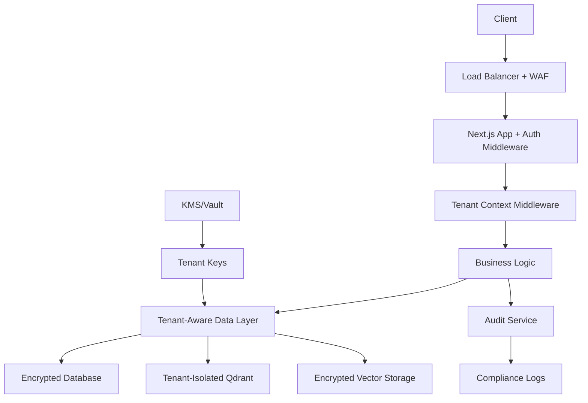

# SaaS Security Upgrade Plan

## 🎯 Project Goal

Transform the current single-tenant agent swarm platform into a secure, scalable, multi-tenant SaaS business by implementing comprehensive security measures, data isolation, and proper authentication/authorization systems. This upgrade will enable hundreds or thousands of customer organizations to safely run their agent platforms on our infrastructure without risk of data exposure or cross-tenant contamination.

**Success Criteria:**
- Complete tenant isolation for all data (database, vector storage, memory)
- Enterprise-grade encryption for all sensitive data
- Proper authentication and authorization system
- Compliance with security standards (SOC2, GDPR ready)
- Zero cross-tenant data leakage risk
- Scalable infrastructure supporting 1000+ tenants

---

## 🔍 Security Audit Summary

### Current Security State: **MODERATE RISK**

**Strengths:**
- ✅ Basic encryption for OAuth tokens using AES-256-CBC
- ✅ Some tenant isolation patterns (`userId`/`organizationId` fields)
- ✅ Basic authentication flows for social media platforms
- ✅ PII redaction system foundation
- ✅ Audit logging for connections and actions
- ✅ Memory isolation manager architecture

**Critical Vulnerabilities:**
- ❌ **No proper authentication/authorization system** (NextAuth, JWT, etc.)
- ❌ **Qdrant has NO tenant isolation** - all vector data is shared globally
- ❌ **Database queries lack consistent Row-Level Security (RLS)**
- ❌ **API endpoints have no access control middleware**
- ❌ **Encryption keys not properly managed** (defaults to weak keys)
- ❌ **No rate limiting or DDoS protection**
- ❌ **Sensitive data logging** (tokens, credentials in logs)

---

## 🚨 Major Security Risks for SaaS

### 1. **Data Breach Risk: CRITICAL**
```typescript
// Current issue: Anyone can access any tenant's data
const response = await fetch('/api/social-media/connections');
// Returns ALL connections from ALL tenants - no authentication check!
```

### 2. **Memory/Knowledge Leakage: HIGH**
```typescript
// Qdrant collections are global - no tenant separation
const memories = await qdrantClient.searchPoints('memories', query);
// Could return memories from ANY tenant's agents
```

### 3. **Token Theft: HIGH**
```typescript
// Weak encryption key management
constructor(masterKey?: string) {
  this.masterKey = masterKey || process.env.ENCRYPTION_MASTER_KEY || this.generateSecureKey();
  // Generates random key per instance - data becomes unrecoverable!
}
```

---

## 📋 SaaS Security Upgrade Plan

### Phase 1: Authentication & Authorization (CRITICAL - 2-3 weeks)

**1.1 Identity Management**
```typescript
// Implement NextAuth.js or similar
import NextAuth from 'next-auth'
import { PrismaAdapter } from "@next-auth/prisma-adapter"

// Add to schema.prisma:
model User {
  id            String    @id @default(cuid())
  email         String    @unique
  emailVerified DateTime?
  name          String?
  tenantId      String    // Key for tenant isolation
  role          String    @default("user") // user, admin, super_admin
  // ... standard NextAuth fields
}

model Tenant {
  id           String @id @default(cuid()) 
  name         String
  subdomain    String @unique
  planType     String @default("free") // free, pro, enterprise
  encryptionKey String // Unique per tenant
  settings     Json   // Tenant-specific settings
}
```

**1.2 API Middleware**
```typescript
// Create authentication middleware
export function withAuth(handler: NextApiHandler) {
  return async (req: NextApiRequest, res: NextApiResponse) => {
    const session = await getServerSession(req, res, authOptions);
    if (!session) {
      return res.status(401).json({ error: 'Unauthorized' });
    }
    
    // Add tenant context to request
    req.tenantId = session.user.tenantId;
    req.userId = session.user.id;
    
    return handler(req, res);
  };
}
```

#### Phase 1 Implementation Checklist

**Identity System Setup:**
- [ ] Install and configure NextAuth.js
- [ ] Create User and Tenant models in Prisma schema
- [ ] Set up authentication providers (email/password, OAuth)
- [ ] Implement user registration flow
- [ ] Create tenant creation flow
- [ ] Set up email verification system
- [ ] Configure session management
- [ ] Create user profile management

**API Security:**
- [ ] Create authentication middleware (`withAuth`)
- [ ] Create tenant context middleware (`withTenant`)
- [ ] Apply authentication to all API routes
- [ ] Implement role-based access control (RBAC)
- [ ] Create admin-only endpoints for tenant management
- [ ] Add request context logging
- [ ] Set up CORS policies
- [ ] Implement API key authentication for service accounts

**Frontend Integration:**
- [ ] Add login/logout UI components
- [ ] Create tenant selection/switching UI
- [ ] Implement protected route guards
- [ ] Add user profile management UI
- [ ] Create tenant settings dashboard
- [ ] Add session status indicators
- [ ] Implement proper error handling for auth failures

---

### Phase 2: Multi-Tenant Data Isolation (CRITICAL - 3-4 weeks)

**2.1 Database Row-Level Security**
```sql
-- Enable RLS on all tenant-shared tables
ALTER TABLE "WorkspaceConnection" ENABLE ROW LEVEL SECURITY;
ALTER TABLE "SocialMediaConnection" ENABLE ROW LEVEL SECURITY;
ALTER TABLE "Chat" ENABLE ROW LEVEL SECURITY;

-- Create policies
CREATE POLICY tenant_isolation_workspace ON "WorkspaceConnection"
  FOR ALL TO authenticated_role
  USING (
    "userId" = current_setting('app.current_user_id') OR
    "organizationId" = current_setting('app.current_tenant_id')
  );
```

**2.2 Qdrant Tenant Isolation**
```typescript
export class TenantAwareQdrantClient {
  private getTenantCollectionName(baseName: string, tenantId: string): string {
    return `${tenantId}_${baseName}`;
  }
  
  async searchPoints<T>(
    baseName: string, 
    tenantId: string,
    query: SearchQuery
  ): Promise<MemorySearchResult<T>[]> {
    const collectionName = this.getTenantCollectionName(baseName, tenantId);
    return this.client.searchPoints(collectionName, query);
  }
}
```

**2.3 Memory Service Tenant Isolation**
```typescript
export class TenantMemoryService {
  async storeMemory(
    tenantId: string, 
    memory: Memory
  ): Promise<void> {
    // Validate tenant access
    await this.validateTenantAccess(tenantId);
    
    // Encrypt with tenant-specific key
    const encryptedMemory = await this.encryptForTenant(memory, tenantId);
    
    // Store in tenant-specific collection
    await this.qdrantClient.addPoints(
      this.getTenantCollection('memories', tenantId),
      [encryptedMemory]
    );
  }
}
```

#### Phase 2 Implementation Checklist

**Database Isolation:**
- [ ] Update all models to include tenantId fields
- [ ] Enable Row-Level Security (RLS) on PostgreSQL
- [ ] Create RLS policies for all tenant-shared tables
- [ ] Update all database queries to filter by tenantId
- [ ] Create database migration scripts
- [ ] Test cross-tenant data access prevention
- [ ] Set up database connection pooling per tenant
- [ ] Implement database query monitoring

**Qdrant Vector Store Isolation:**
- [ ] Create TenantAwareQdrantClient class
- [ ] Implement tenant-specific collection naming
- [ ] Update all vector storage operations
- [ ] Create tenant collection management system
- [ ] Implement collection cleanup for deleted tenants
- [ ] Add vector data migration tools
- [ ] Set up Qdrant monitoring per tenant
- [ ] Test vector data isolation

**Memory System Isolation:**
- [ ] Update MemoryService for tenant isolation
- [ ] Implement tenant-aware memory retrieval
- [ ] Update knowledge graph for tenant separation
- [ ] Create memory migration utilities
- [ ] Implement memory cleanup for tenant deletion
- [ ] Update conversation memory storage
- [ ] Test agent memory isolation
- [ ] Add memory usage monitoring per tenant

**Application Layer Updates:**
- [ ] Update all service classes for tenant awareness
- [ ] Implement tenant context injection
- [ ] Update agent creation to be tenant-scoped
- [ ] Modify chat systems for tenant isolation
- [ ] Update file storage for tenant separation
- [ ] Implement tenant-aware caching
- [ ] Update search functionality
- [ ] Add tenant validation throughout app

---

### Phase 3: Encryption & Key Management (HIGH - 2-3 weeks)

**3.1 Proper Key Management**
```typescript
export class TenantKeyManager {
  private kmsClient: AWS.KMS; // or HashiCorp Vault
  
  async getTenantKey(tenantId: string): Promise<string> {
    // Retrieve tenant-specific encryption key from KMS
    const keyId = `tenant-${tenantId}-encryption-key`;
    const key = await this.kmsClient.decrypt({
      CiphertextBlob: Buffer.from(keyId, 'base64')
    }).promise();
    
    return key.Plaintext!.toString();
  }
  
  async encryptForTenant(data: string, tenantId: string): Promise<string> {
    const key = await this.getTenantKey(tenantId);
    return this.encrypt(data, key);
  }
}
```

**3.2 Field-Level Encryption**
```typescript
// Encrypt sensitive fields at application level
model SocialMediaConnection {
  // ... other fields
  encryptedCredentials String @encrypt(key: "tenant_key")
  // Use application-level encryption middleware
}
```

#### Phase 3 Implementation Checklist

**Key Management System:**
- [ ] Choose KMS provider (AWS KMS, HashiCorp Vault, Azure Key Vault)
- [ ] Set up KMS infrastructure
- [ ] Create TenantKeyManager service
- [ ] Implement key generation for new tenants
- [ ] Set up key rotation policies
- [ ] Create key backup and recovery procedures
- [ ] Implement key access logging
- [ ] Test key management operations

**Encryption Implementation:**
- [ ] Replace current TokenEncryption with tenant-aware version
- [ ] Implement field-level encryption for sensitive data
- [ ] Encrypt OAuth credentials with tenant keys
- [ ] Encrypt agent memories and conversations
- [ ] Encrypt file uploads and attachments
- [ ] Implement encryption for cached data
- [ ] Add encryption status monitoring
- [ ] Create encryption performance benchmarks

**Data Migration:**
- [ ] Create encrypted data migration scripts
- [ ] Migrate existing OAuth tokens to new encryption
- [ ] Re-encrypt existing memories with tenant keys
- [ ] Update file storage encryption
- [ ] Validate data integrity after migration
- [ ] Create rollback procedures
- [ ] Test decryption with new system
- [ ] Document encryption key procedures

---

### Phase 4: Advanced Security Features (MEDIUM - 3-4 weeks)

**4.1 Rate Limiting & DDoS Protection**
```typescript
import rateLimit from 'express-rate-limit';

const createRateLimiter = (windowMs: number, max: number) => 
  rateLimit({
    windowMs,
    max,
    keyGenerator: (req) => `${req.tenantId}:${req.ip}`, // Per-tenant limits
    message: { error: 'Too many requests' }
  });

// Apply different limits per plan
export const rateLimiters = {
  free: createRateLimiter(15 * 60 * 1000, 100),    // 100 requests per 15 minutes
  pro: createRateLimiter(15 * 60 * 1000, 1000),    // 1000 requests per 15 minutes
  enterprise: createRateLimiter(15 * 60 * 1000, 10000) // 10000 requests per 15 minutes
};
```

**4.2 Audit & Compliance**
```typescript
export class ComplianceLogger {
  async logDataAccess(
    tenantId: string,
    userId: string,
    dataType: string,
    action: 'CREATE' | 'READ' | 'UPDATE' | 'DELETE',
    resourceId: string
  ): Promise<void> {
    await this.auditLog.create({
      tenantId,
      userId,
      action,
      resourceType: dataType,
      resourceId,
      timestamp: new Date(),
      ipAddress: this.getClientIP(),
      userAgent: this.getUserAgent(),
      // Required for GDPR/SOC2 compliance
    });
  }
}
```

#### Phase 4 Implementation Checklist

**Rate Limiting & Protection:**
- [ ] Implement rate limiting middleware
- [ ] Set up per-tenant rate limits based on plan
- [ ] Configure DDoS protection
- [ ] Add IP-based blocking system
- [ ] Implement request throttling
- [ ] Set up monitoring for abuse patterns
- [ ] Create rate limit bypass for internal services
- [ ] Add rate limit notifications

**Security Headers & Policies:**
- [ ] Implement security headers (HSTS, CSP, etc.)
- [ ] Set up CORS policies
- [ ] Configure Content Security Policy
- [ ] Add XSS protection headers
- [ ] Implement CSRF protection
- [ ] Set up secure cookie policies
- [ ] Add request validation middleware
- [ ] Configure secure communication protocols

**Audit & Compliance:**
- [ ] Create ComplianceLogger service
- [ ] Implement comprehensive audit logging
- [ ] Set up log retention policies
- [ ] Create audit trail viewing system
- [ ] Implement GDPR data export functionality
- [ ] Add right-to-deletion capabilities
- [ ] Set up compliance reporting
- [ ] Create data processing agreements

**Monitoring & Alerting:**
- [ ] Set up security monitoring dashboard
- [ ] Implement anomaly detection
- [ ] Create security alert system
- [ ] Set up failed login attempt monitoring
- [ ] Add suspicious activity detection
- [ ] Implement breach notification system
- [ ] Create security metrics collection
- [ ] Set up automated incident response

---

### Phase 5: Infrastructure Security (HIGH - 2-3 weeks)

**5.1 Environment Separation**
```yaml
# Production security configuration
environments:
  production:
    database:
      ssl: required
      connection_encryption: true
    qdrant:
      api_key: required
      tls: enabled
    redis:
      auth: required
      tls: true
```

**5.2 Secrets Management**
```typescript
// Use proper secrets management
export class ConfigService {
  private static instance: ConfigService;
  
  async getSecret(key: string): Promise<string> {
    // Retrieve from AWS Secrets Manager, Azure Key Vault, etc.
    return await this.secretsClient.getSecretValue(key);
  }
  
  async getTenantConfig(tenantId: string): Promise<TenantConfig> {
    return {
      encryptionKey: await this.getSecret(`tenant-${tenantId}-key`),
      databaseUrl: await this.getSecret(`tenant-${tenantId}-db`),
      // etc.
    };
  }
}
```

#### Phase 5 Implementation Checklist

**Infrastructure Security:**
- [ ] Set up SSL/TLS for all connections
- [ ] Configure secure database connections
- [ ] Enable encryption in transit and at rest
- [ ] Set up VPC and network security groups
- [ ] Configure firewall rules
- [ ] Implement secure backup procedures
- [ ] Set up disaster recovery plan
- [ ] Configure monitoring and logging

**Secrets Management:**
- [ ] Set up secrets management service
- [ ] Migrate all secrets from environment variables
- [ ] Implement secret rotation policies
- [ ] Create secure secret distribution system
- [ ] Set up secret access monitoring
- [ ] Implement secret backup and recovery
- [ ] Create emergency secret reset procedures
- [ ] Document secret management processes

**Production Hardening:**
- [ ] Remove development/debug code from production
- [ ] Configure production logging levels
- [ ] Set up error monitoring (Sentry, etc.)
- [ ] Implement health checks and monitoring
- [ ] Configure load balancing and failover
- [ ] Set up automated backups
- [ ] Create incident response procedures
- [ ] Perform security testing and penetration testing

---

## 🛡️ Recommended Security Architecture



---

## 💰 Cost & Timeline Estimate

| Phase | Priority | Time | Complexity | Cost Impact |
|-------|----------|------|------------|-------------|
| Phase 1: Auth | CRITICAL | 2-3 weeks | Medium | Low |
| Phase 2: Isolation | CRITICAL | 3-4 weeks | High | Medium |
| Phase 3: Encryption | HIGH | 2-3 weeks | Medium | Medium |
| Phase 4: Advanced | MEDIUM | 3-4 weeks | High | High |
| Phase 5: Infrastructure | HIGH | 2-3 weeks | Medium | Medium |

**Total Estimated Time: 12-17 weeks**
**Recommended MVP for launch: Phases 1-3 (7-10 weeks)**

---

## 🎯 Immediate Actions (Next 7 Days)

### Week 1 Priority Tasks:
- [ ] Set up NextAuth.js with basic user/tenant models
- [ ] Add authentication middleware to all API routes
- [ ] Implement tenant-aware Qdrant collections
- [ ] Add proper encryption key management
- [ ] Enable database query filtering by tenantId
- [ ] Create development environment for testing multi-tenancy
- [ ] Set up security testing framework

---

## 📋 Overall Project Checklist

### Pre-Implementation:
- [ ] Review and approve security upgrade plan
- [ ] Set up development and staging environments for security testing
- [ ] Create security testing procedures
- [ ] Set up monitoring and logging infrastructure
- [ ] Prepare team training materials on security practices

### Implementation Phases:
- [ ] **Phase 1: Authentication & Authorization** (2-3 weeks)
- [ ] **Phase 2: Multi-Tenant Data Isolation** (3-4 weeks)
- [ ] **Phase 3: Encryption & Key Management** (2-3 weeks)
- [ ] **Phase 4: Advanced Security Features** (3-4 weeks)
- [ ] **Phase 5: Infrastructure Security** (2-3 weeks)

### Post-Implementation:
- [ ] Conduct comprehensive security audit
- [ ] Perform penetration testing
- [ ] Create security documentation and procedures
- [ ] Train team on new security practices
- [ ] Set up ongoing security monitoring
- [ ] Create incident response procedures
- [ ] Prepare for compliance certifications (SOC2, etc.)

---

## 🚀 Success Metrics

### Security Metrics:
- [ ] Zero cross-tenant data access incidents
- [ ] 100% data encryption coverage
- [ ] All API endpoints protected with authentication
- [ ] Complete audit trail for all data access
- [ ] Sub-100ms authentication response times
- [ ] 99.9% uptime for authentication services

### Compliance Metrics:
- [ ] GDPR compliance readiness
- [ ] SOC2 Type II preparation
- [ ] Complete data lineage tracking
- [ ] Right-to-deletion implementation
- [ ] Data breach notification procedures
- [ ] Privacy policy compliance

---

**Note:** This security upgrade is essential before any SaaS launch. The current architecture would expose all customer data to every user, which is both a massive security risk and regulatory compliance failure. The good news is that your foundational architecture supports these changes well with the existing `organizationId`/`userId` patterns. 