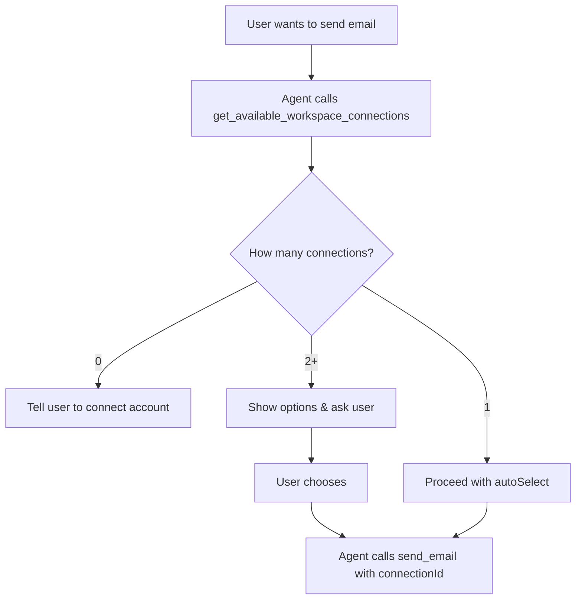

# Multi-Provider Email Selection - User-Friendly Approach

## The Better Way: Agent Asks for Clarification

Instead of silently making decisions, our agents now **inform users about available options** and **ask for clarification** when needed.

## Example Conversation Flow

### User Request
> "Can you send gab@crowd-wisdom.com an email saying that I will be 10 minutes late to our meeting today?"

### Agent Response (with multiple email accounts)

**Step 1: Agent checks available connections**
```json
// Agent calls: get_available_workspace_connections
{
  "capability": "EMAIL_SEND"
}

// Response:
{
  "success": true,
  "message": "Multiple EMAIL_SEND connections available:\n1. John Doe (john@crowd-wisdom.com) (GOOGLE_WORKSPACE)\n2. John Personal (john@gmail.com) (GOOGLE_WORKSPACE)\n3. John Work Zoho (john.doe@zoho-company.com) (ZOHO)",
  "connections": [
    {
      "connectionId": "conn-123",
      "provider": "GOOGLE_WORKSPACE", 
      "connectionName": "John Doe (john@crowd-wisdom.com)",
      "accessLevel": "WRITE"
    },
    {
      "connectionId": "conn-456",
      "provider": "GOOGLE_WORKSPACE",
      "connectionName": "John Personal (john@gmail.com)", 
      "accessLevel": "WRITE"
    },
    {
      "connectionId": "conn-789",
      "provider": "ZOHO",
      "connectionName": "John Work Zoho (john.doe@zoho-company.com)",
      "accessLevel": "WRITE"
    }
  ],
  "requiresUserChoice": true
}
```

**Step 2: Agent responds to user**
> "I can send that email for you! I see you have multiple email accounts connected:
> 
> 1. **John Doe (john@crowd-wisdom.com)** - Google Workspace
> 2. **John Personal (john@gmail.com)** - Google Workspace  
> 3. **John Work Zoho (john.doe@zoho-company.com)** - Zoho
>
> Since you're emailing gab@crowd-wisdom.com, I'd recommend using your **john@crowd-wisdom.com** account (option 1) as it matches the recipient's domain. Should I proceed with that, or would you prefer a different account?"

### User Response Options

**Option A: User agrees**
> "Yes, use the crowd-wisdom account"

**Option B: User chooses different**  
> "Actually, use my personal Gmail instead"

**Option C: User just says proceed**
> "Go ahead"

### Agent Action
```json
// Agent calls: send_email
{
  "to": ["gab@crowd-wisdom.com"],
  "subject": "Running 10 minutes late",
  "body": "Hi Gab,\n\nI wanted to let you know that I'm running about 10 minutes late to our meeting today. I'll be there as soon as possible.\n\nThanks for your understanding!\n\nBest regards",
  "connectionId": "conn-123"  // Uses the selected connection
}
```

## Single Account (No Choice Needed)

### User Request
> "Send an email to team@company.com about tomorrow's meeting"

### Agent Response
```json
// Agent calls: get_available_workspace_connections
{
  "capability": "EMAIL_SEND"
}

// Response:
{
  "success": true,
  "message": "One EMAIL_SEND connection available: John Doe (john@company.com)",
  "connections": [{"connectionId": "conn-123", ...}],
  "recommendation": "You can proceed with this connection.",
  "autoSelect": "conn-123"
}
```

**Agent proceeds directly:**
> "I'll send that email from your john@company.com account. What should the subject and content be?"

## No Accounts Available

### User Request
> "Send an email to support@example.com"

### Agent Response
```json
// Response:
{
  "success": false,
  "message": "No EMAIL_SEND connections available. Please connect a workspace provider first.",
  "connections": []
}
```

**Agent responds:**
> "I'd be happy to help send that email, but I don't see any email accounts connected to your workspace. You'll need to connect a Google Workspace, Microsoft 365, or Zoho account first. Would you like me to guide you through that process?"

## Benefits of This Approach

### ✅ **Transparent & User-Controlled**
- User always knows which account will be used
- No surprises or wrong-account emails
- User maintains full control

### ✅ **Intelligent Recommendations**
- Agent suggests best option based on domain matching
- Explains reasoning ("matches recipient's domain")
- Still allows user override

### ✅ **Better UX**
- Clear communication about available options
- Natural conversation flow
- Reduces user anxiety about email source

### ✅ **Handles All Scenarios**
- Single account: proceeds smoothly
- Multiple accounts: asks for clarification
- No accounts: guides user to setup

## Implementation Details

### Required Tools
1. **`get_available_workspace_connections`** - Check what's available
2. **`send_email`** - Send with explicit connectionId
3. **`get_all_workspace_connections`** - Overview of all connections

### LLM Instructions
The agent is instructed to:
1. **Always check** available connections first
2. **Recommend** the best option when multiple exist
3. **Ask for confirmation** before proceeding
4. **Explain reasoning** for recommendations

### Tool Flow


This approach respects user agency while providing intelligent assistance! 🎯 